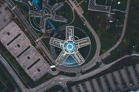
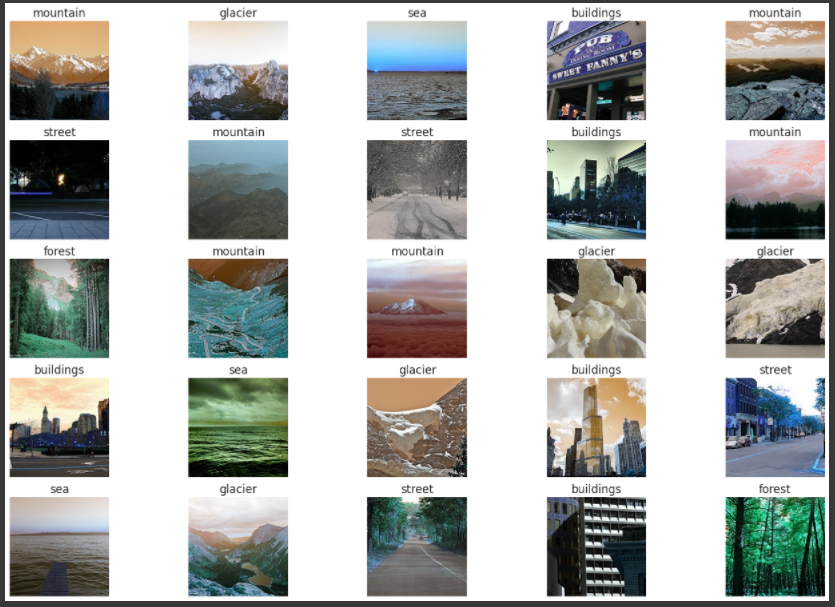
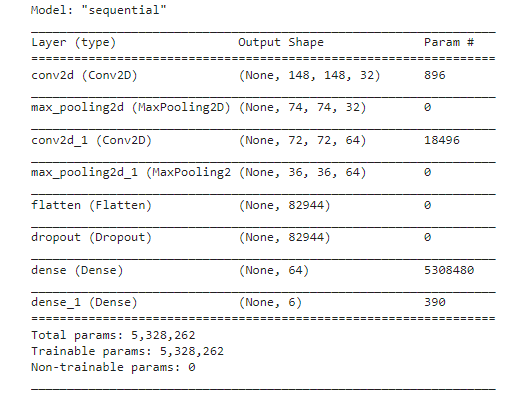
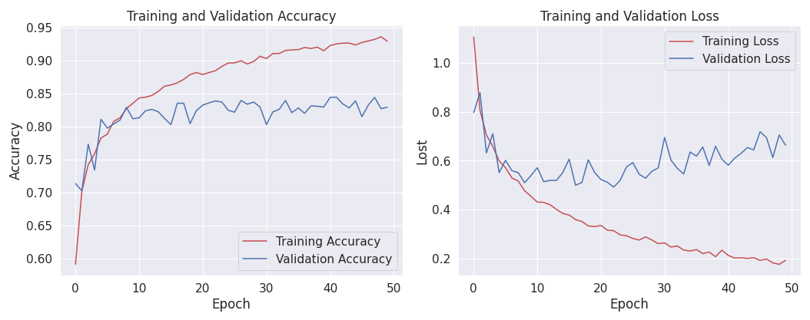

<h1 align="center">Image Scene Classification</h1>

    

## Overview
In this project, I classify images of natural landscapes using the Convolution Neural Network from Tensorflow. This Data contains around 25k images of size 150x150 distributed under 6 categories. The category is bukdings, forest, glacier, mountain, sea, and street. There are around 14k images in Train, 3k in Test and 7k in Prediction. This data was initially published on https://datahack.analyticsvidhya.com by Intel to host a Image classification Challenge. You can also get it on [Kaggle](https://www.kaggle.com/puneet6060/intel-image-classification).

## Works Step
<ol>
  <li>Kaggle Configuration</li>
  <li>Download Dataset</li>
  <li>Import Libraries</li>
  <li>Extract Dataset</li>
  <li>Images Sample</li>
  <li>Image Augmentation</li>
  <li>Build the CNN Model</li>
  <li>Plotting accuracy and loss</li>
  <li>Save the Model to TF-Lite</li>
</ol>  

## Images Sample

## Model Summary

## Model Performance
Training Accuracy = 92.98%  
Validation Accuracy = 82.95  
Training Loss = 0.1918  
Validation Loss = 0.6635  

## Plotting Accuracy and Loss

